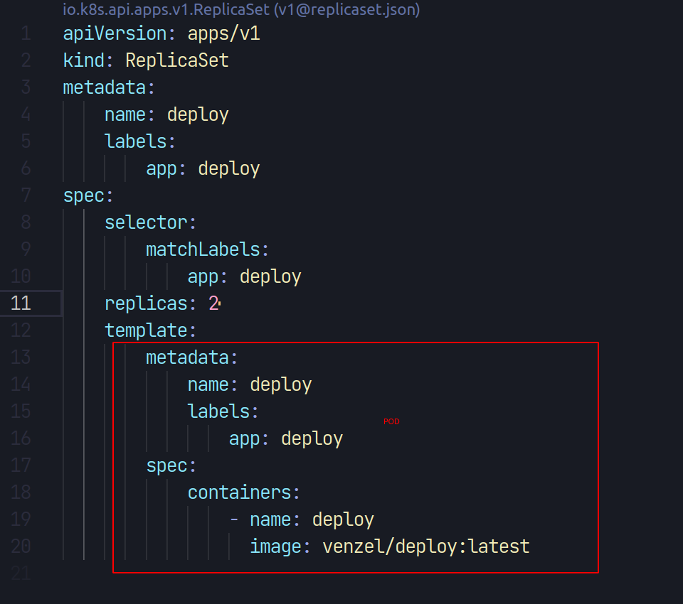

# K8s

## Origem

**Google:**

-   Borg
-   Omega
-   Kubernetes

## Definições

-   **Cluster:** é o conjunto de máquinas (nodes), cada máquina possui sua quantidade de vCPU e memória.
-   **Pod:** unidade que contém os containers provisionados, o pod representa os processos rodando no cluster. Normalmente utiliza um container por pod.

## FAQ

👉 [Namespaces & Contextos](./CONTEXTS.md)<br />
👉 [Deploy app Go](./DEPLOY.md)

## Kind

Kind é um gerenciador de clusters, uma alternativa ao minikube e ao k3d.

### Instalação

Documentação: https://kind.sigs.io/

```bash
# Baixa o binário
[ $(uname -m) = x86_64 ] && curl -Lo ./kind https://kind.sigs.io/dl/v0.20.0/kind-linux-amd64

# Torna executável
chmod +x ./kind

# Move o kind para /usr/local/bin
sudo mv ./kind /usr/local/bin/kind
```

### Kind.yaml

```yaml
kind: Cluster
apiVersion: kind.x-io/v1alpha4
nodes:
    - role: control-plane
    - role: worker
    - role: worker
    - role: worker
```

### Criação do cluster

```bash
# Cria o cluster
kind create cluster --config=kind.yaml --name=venzel

# Altera o contexto
kubectl cluster-info --context kind-venzel
```

### Deleção do cluster

```bash
kind delete clusters venzel
```

## Instalação do Kubectl

Documentação: https://kubernetes.io/docs/tasks/tools/install-kubectl-linux/

```bash
curl -LO "https://dl.io/release/$(curl -L -s https://dl.io/release/stable.txt)/bin/linux/amd64/kubectl"

sudo install -o root -g root -m 0755 kubectl /usr/local/bin/kubectl
```

## Comandos Kubectl

```bash
# Verifica as configurações
cat ~/.kube/config

# Verificar os clusters
kubectl config get-clusters

# Alterar o contexto
kubectl config use-context k3d-k3s-default

# Verifica os namespaces disponíveis
kubectl get ns

# Verifica os nós
kubectl get nodes

# Verifica os pods
kubectl get pods

# Acessa um pod
kubectl exec -it nome-do-pod -- bash

# Exibe detalhes de um pod
kubectl describe pod nome-do-pod

# Verifica os services
kubectl get svc

# Api do kubernetes
kubectl proxy --port=8080
```

## Pod

```bash
# Aplica o POD
kubectl apply -f pod.yaml

# Verifica os pods
kubectl get pods

# Exibe detalhes de um pod (deploy-kxv5k é um pod fictício)
kubectl describe pod deploy-kxv5k

# Expõe a porta de um pod
# 3000 é a porta do go server
kubectl port-forward pod/deploy 8000:3000

# Teste
curl localhost:8000
# Tudo ok!

# Deleta o pod
kubectl delete pod deploy
```

## ReplicaSet



```bash
# Aplica o ReplicaSet
kubectl apply -f replicaset.yaml

# Exibe os pods
kubect get pods
# NAME           READY   STATUS    RESTARTS   AGE
# deploy-56vq9   1/1     Running   0          105s
# deploy-kxv5k   1/1     Running   0          105s

# Deletar o replicaset
kubectl delete replicaset deploy
# replicaset.apps "deploy" deleted
```

## Deployment

Lembrando que quando utiliza o deployment, ele recria os pods caso tenha algo novo. Também ocorre que os pods são encerrados de forma que não fique fora do ar.

```bash
# Aplica o deployment
kubectl apply -f deployment.yaml

# Aplica o deployment e observa os pods
kubectl apply -f deployment.yaml && watch -n1 kubectl get pods

# Deletar um deploy
kubectl delete deployment deploy
# deployment.apps "deploy" deleted
```

## Rollout e Revisões

```bash
# Exibe as revisões
kubectl rollout history deployment deploy
# REVISION  CHANGE-CAUSE
# 1         <none>

# Volta para uma revisão anterior
kubectl rollout undo deployment deploy
kubectl rollout undo deployment deploy --to-revision=2
```

## Service

### ClusterIP

```bash
# Aplica o serviço
kubectl apply -f service.yaml
#service/deploy-service created

# Exibe os serviços
kubectl get svc
# NAME             TYPE        CLUSTER-IP     EXTERNAL-IP   PORT(S)   AGE
# deploy-service   ClusterIP   10.96.56.103   <none>        80/TCP    108s
# kubernetes       ClusterIP   10.96.0.1      <none>        443/TCP   23h

# Expondo a porta do serviço
kubectl port-forward svc/deploy-service 8000:80
# Forwarding from 127.0.0.1:8000 -> 3000
# Forwarding from [::1]:8000 -> 3000
# Handling connection for 8000

# Deleta um serviço
kubectl delete svc deploy-service
# service "deploy-service" deleted
```

## HPA


<div>
  
  <sub>Made with 💙 by <a href="https://github.com/venzel">Enéas Almeida</a></sub>
</div>
